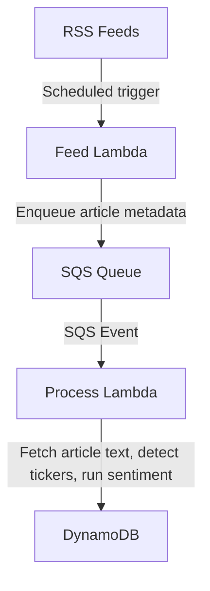

# mss-financial-sentiment-lambda

Doing sentiment analysis on related news collected from RSS feed(s)

## Overview
This repository implements two AWS Lambda functions for financial news sentiment analysis:

- **Feed Lambda**: Collects news article metadata from RSS feeds and enqueues them for processing.
- **Process Lambda**: Consumes queued articles, fetches their content, performs sentiment analysis, and stores results in DynamoDB.

## Architecture



## Lambda Details

### Feed Lambda
- Periodically triggered (e.g., by EventBridge schedule)
- Parses configured RSS feeds
- For each new article:
    - Extracts metadata (title, url, pubdate, feedUrl)
    - Enqueues message to SQS for processing

### Process Lambda
- Triggered by SQS events
- For each message:
    - Downloads article text
    - Detects related tickers using fulltext/company name matching - drop out if we are not interested in
    - Runs sentiment analysis (using Loughran-McDonald lexicon)
    - Stores a flattened record in DynamoDB:
        - `id` (url), `feedUrl`, `pubdate`, `sentiment_score`, `sentiment_label`, `tickers` (comma-separated), `title`, `ttl`, `url`
    - Handles retry logic (up to 5 attempts)
    - Drops items after 5 failed attempts

## Data Model
- **DynamoDB Table**: `mss_sentiment_articles`
- Each row contains flattened columns for easy querying and export

## Example Record
```csv
id,feedUrl,pubdate,sentiment_score,sentiment_label,tickers,title,ttl,url
"https://www.bbc.com/news/articles/cwyq7vgq2e5o","https://feeds.bbci.co.uk/news/business/rss.xml","Sun, 29 Jun 2025 22:57:37 GMT",-0.041411764705882356,negative,META,"Boeing's 787 Dreamliner was deemed the 'safest' of planes. The whistleblowers were always less sure",1756589243,"https://www.bbc.com/news/articles/cwyq7vgq2e5o"
```

## Querying
- You can search for articles by ticker using DynamoDB's `contains` or SQL-like queries (e.g., `contains(tickers, 'GOOGL')`).
- Sentiment and ticker fields are flattened for easy analytics and export.
